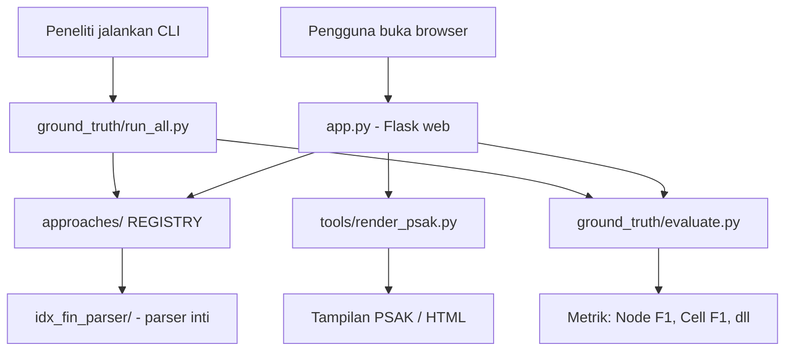
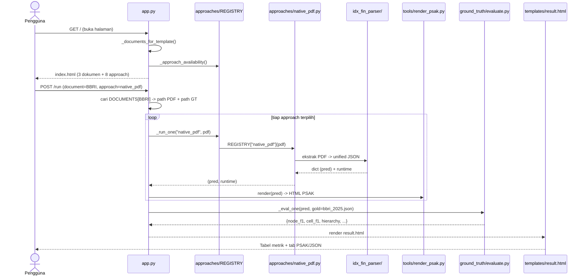
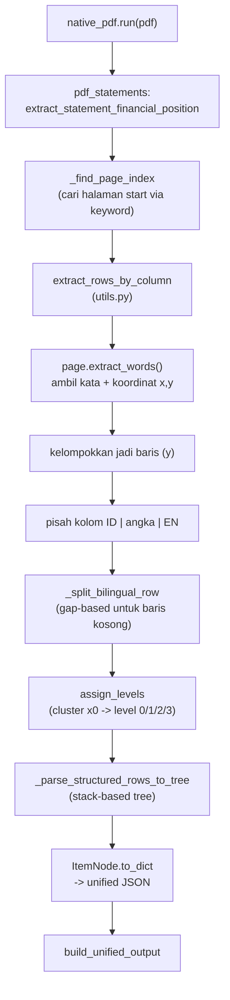
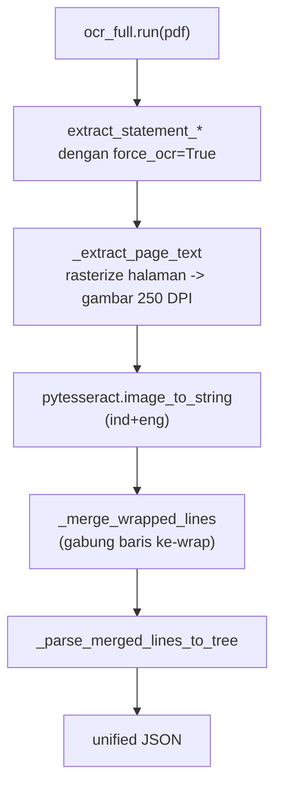
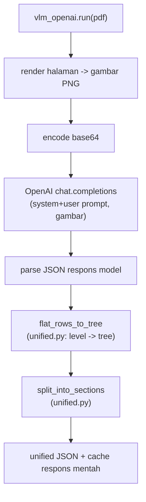
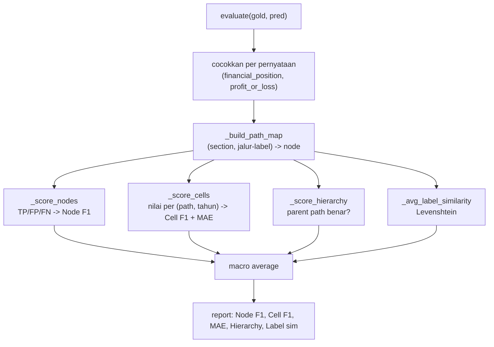
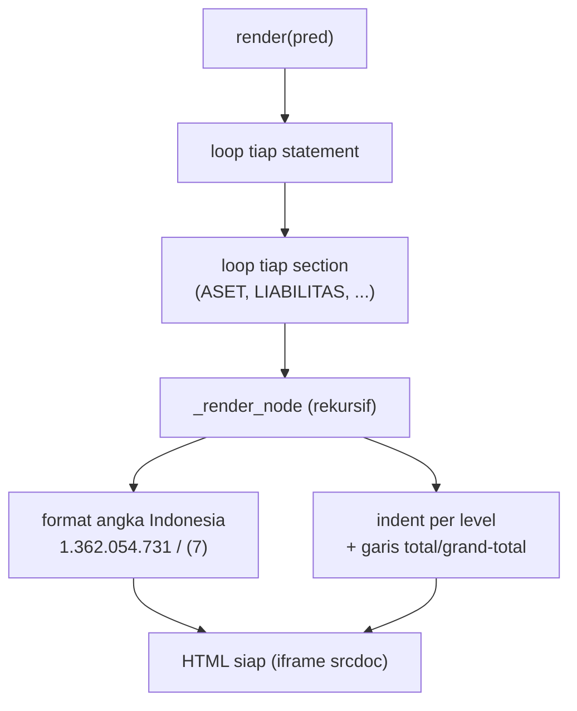
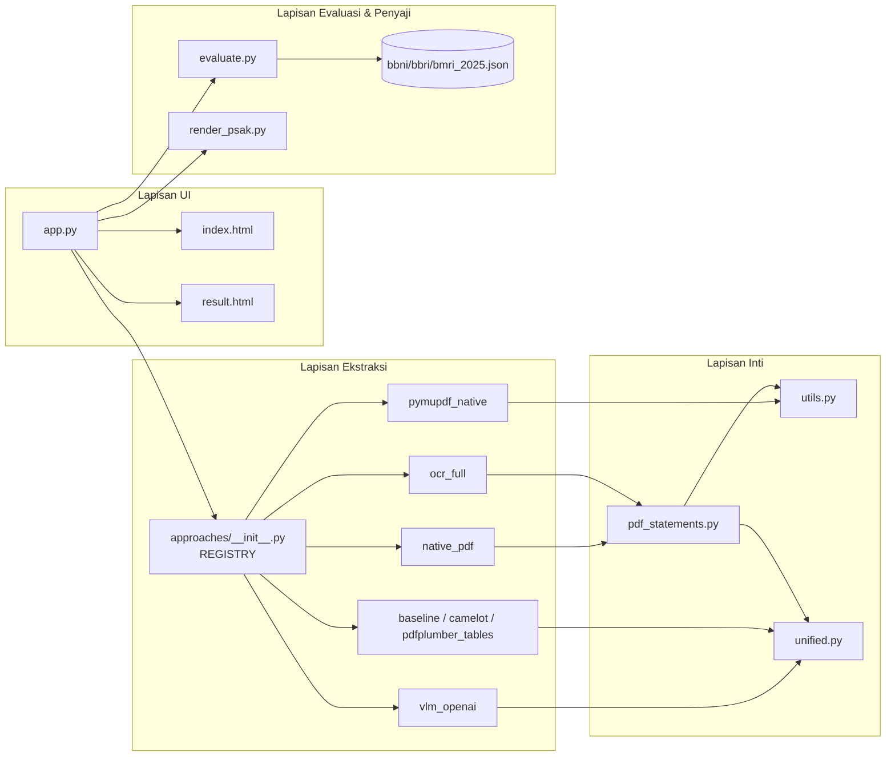

# Penjelasan Alur Kerja Kode — Sistem Ekstraksi Laporan Keuangan IDX

Dokumen ini menjelaskan **alur kerja kode** mulai dari `app.py` (web)
sampai hasil tampil di layar: file apa dipakai di mana, kapan, dan untuk
apa. Disertai diagram Mermaid.

> **Cara render diagram Mermaid di Google Docs:**
> Google Docs belum render Mermaid secara bawaan. Tiga opsi:
> 1. Pasang add-on **"Mermaid"** (Extensions → Add-ons → Get add-ons → cari "Mermaid").
> 2. Atau buka https://mermaid.live , tempel kode diagram, export PNG, lalu
>    Insert → Image ke Docs.
> 3. Atau biarkan sebagai blok kode (tetap terbaca sebagai teks terstruktur).

---

## 1. Gambaran Umum: Dua Pintu Masuk

Sistem punya **dua entry point** yang memakai inti kode yang sama:

| Entry point | Untuk apa | Dipakai kapan |
|---|---|---|
| `app.py` (Flask web) | Demo interaktif: pilih dokumen + approach, lihat metrik & hasil | Saat presentasi / eksplorasi |
| `ground_truth/run_all.py` (CLI) | Batch: jalankan semua approach, simpan tabel komparasi untuk thesis | Saat generate hasil Bab 4 |

Keduanya memanggil **modul inti yang identik**, jadi memahami `app.py`
otomatis menjelaskan `run_all.py`.



---

## 2. Peta File: Siapa Dipakai oleh Siapa

| File | Peran | Dipanggil oleh |
|---|---|---|
| **`app.py`** | Server web Flask, 3 route (`/`, `/run`, `/api/run`) | Pengguna (browser) |
| **`templates/index.html`** | Halaman pilih dokumen + approach | `app.py` route `/` |
| **`templates/result.html`** | Halaman hasil (tabel metrik + tab per-approach) | `app.py` route `/run` |
| **`approaches/__init__.py`** | Registry approach + pemuat `.env` | `app.py`, `run_all.py` |
| **`approaches/*.py`** (8 file) | Tiap pendekatan ekstraksi | `REGISTRY[nama](pdf)` |
| **`idx_fin_parser/pdf_statements.py`** | Pipeline ekstraksi native + OCR | `native_pdf.py`, `ocr_full.py` |
| **`idx_fin_parser/utils.py`** | Utilitas: kolom, level, kontinuasi, deteksi tahun | `pdf_statements.py`, approach |
| **`idx_fin_parser/unified.py`** | Skema data terpadu + konversi flat→tree | semua approach |
| **`ground_truth/evaluate.py`** | Hitung 5 metrik vs ground truth | `app.py`, `run_all.py`, `compare.py` |
| **`ground_truth/bbni/bbri/bmri_2025.json`** | Ground truth (jawaban benar) | `evaluate` (sebagai `gold`) |
| **`tools/render_psak.py`** | Render JSON → HTML format PSAK | `app.py`, CLI |
| **`ground_truth/run_all.py`** | Orkestrator batch + tulis comparison | Peneliti (CLI) |
| **`ground_truth/template_idx.py`** | Template struktur GT (label sekali tulis) | `build_bbri/bmri_2025.py` |
| **`tools/make_figures.py`** | Grafik matplotlib dari comparison | Peneliti (CLI) |
| **`tools/cross_bank_summary.py`** | Tabel ringkasan lintas-bank | Peneliti (CLI) |

---

## 3. Alur Utama: Dari Klik sampai Hasil (Web)

Ini skenario inti: pengguna pilih dokumen **BBRI**, centang approach
**native_pdf**, klik "Jalankan Ekstraksi".



### Penjelasan langkah demi langkah

**Langkah 1 — Buka halaman (`GET /`)**
`app.py` fungsi `index()` memanggil:
- `_documents_for_template()` → daftar 3 dokumen (BBNI/BBRI/BMRI) + status GT.
- `_approach_availability()` → 8 approach + status (VLM disabled kalau tak ada API key).
Lalu render `templates/index.html`.

**Langkah 2 — Submit form (`POST /run`)**
`app.py` fungsi `run()`:
1. Baca `document=BBRI` → ambil `DOCUMENTS["BBRI"]` = `{pdf, gt, issuer_full}`.
2. Baca daftar `approach` yang dicentang.
3. Untuk tiap approach, panggil `_run_one(name, pdf_path)`.

**Langkah 3 — Jalankan satu approach (`_run_one`)**
```python
pred, approach_runtime = REGISTRY[name](pdf_path)   # ekstraksi
psak_html = render_psak_html(pred)                  # render PSAK
```
- `REGISTRY[name]` = fungsi `run()` di `approaches/<name>.py`.
- Hasilnya `pred` = JSON unified, `runtime` = detik.

**Langkah 4 — Evaluasi (`_eval_one`)**
Karena BBRI punya ground truth, `evaluate(gold, pred)` dipanggil →
hitung Node F1, Cell F1, Hierarchy.

**Langkah 5 — Render hasil**
`result.html` menampilkan tabel komparasi + tab per-approach
(PSAK view via iframe + raw JSON).

---

## 4. Alur di Dalam Approach (Inti Ekstraksi)

Setiap approach beda cara, tapi semua **wajib** mengembalikan JSON
unified. Berikut alur untuk approach utama.

### 4a. `native_pdf` (rule-based, berbasis koordinat)



File yang terlibat:
- `approaches/native_pdf.py` — pembungkus
- `idx_fin_parser/pdf_statements.py` — pipeline (`extract_statement_*`, `_parse_structured_rows_to_tree`)
- `idx_fin_parser/utils.py` — `extract_rows_by_column`, `_split_bilingual_row`, `assign_levels`, `ItemNode`
- `idx_fin_parser/unified.py` — `build_unified_output`

### 4b. `pymupdf_native` (sama algoritma, beda pustaka)
Identik dengan native_pdf tapi ekstraksi kata pakai **PyMuPDF**
(`page.get_text("words")`) di `approaches/pymupdf_native.py`, lalu lanjut
ke `assign_levels` + `_parse_structured_rows_to_tree` yang sama.

### 4c. `ocr_full` (Tesseract)


File: `approaches/ocr_full.py` → `pdf_statements.py` (`_extract_page_text`,
`_merge_wrapped_lines`, `_parse_merged_lines_to_tree`).

### 4d. `vlm_openai` (GPT-4o / GPT-4o-mini via API)


File: `approaches/vlm_openai.py` → `idx_fin_parser/unified.py`
(`flat_rows_to_tree`, `split_into_sections`, `build_unified_output`).

### 4e. Approach generik (`baseline_regex`, `pdfplumber_tables`, `camelot_lattice`)
Ketiganya lebih sederhana: ekstrak teks/tabel → bentuk node →
`split_into_sections` (unified.py) → `build_unified_output`.

---

## 5. Alur Evaluasi (Hitung Metrik)



File: `ground_truth/evaluate.py`. Input `gold` = salah satu
`bbni/bbri/bmri_2025.json`, input `pred` = output approach.

---

## 6. Alur Penyajian (PSAK Render)


File: `tools/render_psak.py`. Dipanggil `app.py` saat menyiapkan tab
"PSAK View" tiap approach.

---

## 7. Kapan Tiap File Dipakai (Ringkas)

| Momen | File yang aktif |
|---|---|
| Buka halaman web | `app.py` (`index`), `templates/index.html`, `approaches/__init__.py` |
| Klik "Jalankan" | `app.py` (`run`, `_run_one`) |
| Ekstraksi native | `approaches/native_pdf.py` → `pdf_statements.py` → `utils.py` → `unified.py` |
| Ekstraksi OCR | `approaches/ocr_full.py` → `pdf_statements.py` (Tesseract) |
| Ekstraksi VLM | `approaches/vlm_openai.py` → OpenAI API → `unified.py` |
| Render PSAK | `tools/render_psak.py` |
| Hitung metrik | `ground_truth/evaluate.py` + `*_2025.json` (gold) |
| Tampilkan hasil | `templates/result.html` |
| Batch thesis (CLI) | `ground_truth/run_all.py` → semua approach → `comparison.md/json` |
| Bikin grafik | `tools/make_figures.py` |
| Ringkasan 3 bank | `tools/cross_bank_summary.py` |
| Bangun ground truth | `ground_truth/build_*.py` → `template_idx.py` → `*_2025.json` |

---

## 8. Hubungan Antar-Lapisan (Gambaran Besar)



---

## 9. Ringkasan Satu Kalimat per File

- **`app.py`** — otak web: terima pilihan, jalankan approach, evaluasi, render.
- **`approaches/__init__.py`** — daftar approach + muat API key dari `.env`.
- **`approaches/native_pdf.py`** — ekstraksi koordinat (pdfplumber), approach utama.
- **`approaches/pymupdf_native.py`** — sama, tapi pakai PyMuPDF (37x lebih cepat).
- **`approaches/ocr_full.py`** — OCR Tesseract untuk simulasi PDF scan.
- **`approaches/vlm_openai.py`** — kirim gambar ke GPT-4o, terima JSON.
- **`approaches/{baseline_regex,pdfplumber_tables,camelot_lattice}.py`** — pembanding generik.
- **`idx_fin_parser/pdf_statements.py`** — pipeline cari halaman → ekstrak → bangun pohon.
- **`idx_fin_parser/utils.py`** — alat: pisah kolom, deteksi level, gabung baris.
- **`idx_fin_parser/unified.py`** — kontrak data: semua approach output bentuk sama.
- **`ground_truth/evaluate.py`** — hitung 5 metrik vs jawaban benar.
- **`ground_truth/*_2025.json`** — jawaban benar (transkripsi manual).
- **`tools/render_psak.py`** — ubah JSON jadi tampilan laporan keuangan baku.
- **`ground_truth/run_all.py`** — versi batch untuk generate hasil thesis.

---

*Dokumen ini fokus pada alur eksekusi. Untuk detail algoritma tiap tahap,
lihat PENJELASAN_LOGIKA.md.*
